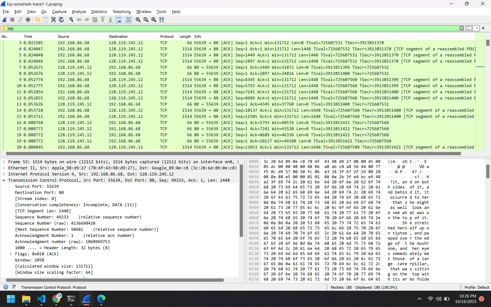

# Hands On Wireshark TCP & UDP

| Nama               | NRP        | Kelas    |
| ------------------ | ---------- | -------- |
| Daud Dhiya' Rozaan | 5025211021 | Jarkom D |

## Wireshark TCP

### No 1

IP Address : 192.168.86.68
Source Port : 55639

### No 2

IP Address : 128.119.245.12
Destination Port = 80

### No 3

a. Sequence number (raw) TCP SYN : 4236649187

b. Flags : 0x002 (SYN)

c. Yes, because SACK allowed in SYN segment

### No 4

a. Sequence number (raw) TCP SYNACK : 1068969752

b. Flags : 0x012 (SYN, ACK)

c. Acknowledgment number : 4236649188

d. From sequence number segmen SYN before, that is 4236649187, plus by one

### No 5

a. Sequence number (raw) : 4236649188

b. TCP payload : 1385 bytes

c. No, because the packet was sent by MIME multipart

### No 7

Ans : 4 \* (Payload + Header) = 4 \* (1448 + 32) = 4 \* 1480 = 5920 byte

### No 10

Receiver typically acknowledge 1448 bytes

## Wireshark UDP

### No 1

a. Packet number : 5

b. SSDP (Simple Service Discovery Protocol)

c. 4 fields in UDP header : source port, destination port, length, checksum

### No 2

UDP header memiliki panjang tetap yaitu 8 bytes. Masing-masing dari 4 fields UDP header memiliki length 2 bytes.

### No 3

Length field memiliki value dari header + data. Explicit length value dibutuhkan karena ukuran field data dapat berbeda dari sebuah UDP segment dengan UDP segment setelahnya.
Length UDP payload pada packet ini adalah 292 bytes - 8 bytes = 284 bytes.

### No 4

Maksimum nilai pada UDP payload adalah (2^16 – 1) bytes plus header bytes sehingga 65535 bytes – 8 bytes = 65527 bytes.

### No 5

Ukuran terbesar yang mungkin dari source port number adalah (2^16 – 1) = 65535.

### No 6

Protocol Number UDP : 17

### No 7

a. Packet number of the first of these two UDP segments in the trace file : 15

b. Packet number of the second of these two UDP segments in the trace file : 17

c. Relationship between the port numbers in the two packets : The source port for packet 15 is the destination port for packet 17 and it can be applied in the opposite.
